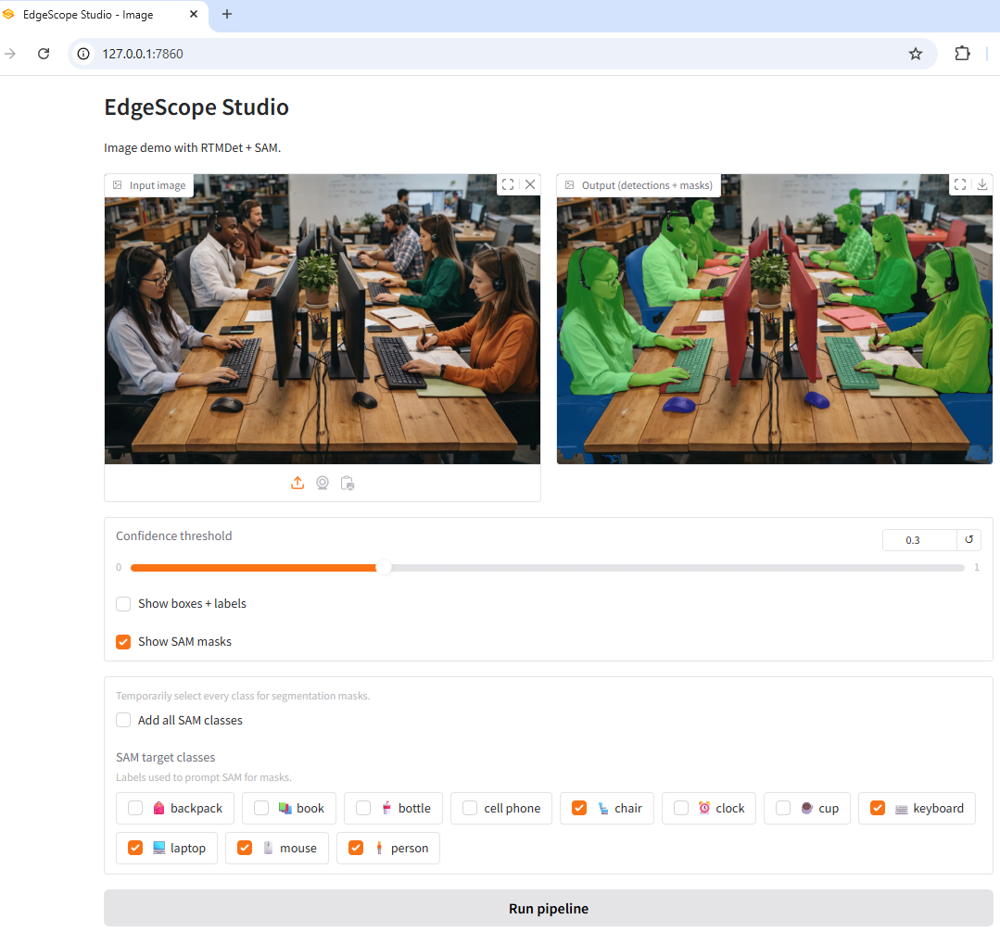

[](https://github.com/mcherif/edgescope-studio/actions/workflows/video.yml)

**EdgeScope Studio** is a **local-first** computer vision lab for prototyping **image and video** pipelines on your own machine (offline).

It has two modes:

- **Image mode ([RTMDet](#acronym-rtmdet) + [SAM](#acronym-sam))**: general object detection + promptable segmentation for still images.
- **Video mode ([RVM](#acronym-rvm))**: real-time portrait matting + background blur with **temporal stability** (recurrent states).

The core idea:

- Image mode: load your images -> run a permissive detector ([RTMDet](#acronym-rtmdet) Tiny on COCO) + [SAM](#acronym-sam) -> inspect boxes & masks -> iterate on thresholds, models, and logic without touching the cloud.
- Video mode: [RVM](#acronym-rvm) recurrent states -> alpha matte -> blur compositor.

Video mode uses RVM to produce a temporally-stable alpha matte per frame; no detector/SAM in the loop.

This is designed as a **general CV tool**, but with a strong focus on **on-device and privacy-preserving use cases** (e.g. ergonomics / digital wellbeing, industrial inspection, etc.).

For real-time portrait effects we use **Robust Video Matting ([RVM](#acronym-rvm))** (video-native, recurrent temporal states).
For general object segmentation in still images we use **detect -> segment ([RTMDet](#acronym-rtmdet) + [SAM](#acronym-sam))**.

[RVM](#acronym-rvm) is a video matting model that keeps **recurrent state** across frames, which stabilizes edges and reduces flicker compared to per-frame-only inference. Those temporal states let the model "remember" motion and fine hair detail so the mask stays coherent over time.



## Quick start: Video mode ([RVM](#acronym-rvm) background blur)

**Requirements:** Windows + NVIDIA GPU recommended (ONNX Runtime CUDA).  
**Model:** Robust Video Matting (RVM) MobileNetV3 ONNX (downloaded locally; not committed).

### 1) Setup (download/verify model, write IO metadata)
```bash
python scripts/setup_video.py
```

### 2) Run webcam demo (OpenCV window)
```bash
python scripts/run_video.py --device cuda --input-size 512 --downsample 0.25
# CPU fallback (slower)
python scripts/run_video.py --device cpu --input-size 512 --downsample 0.25
```

Controls: `q` quit, `b` toggle blur/debug, `r` reset temporal state

### 3) Windows capture backend (auto-select + caching)
Default backend is `auto` (probe + cache). Auto mode will:
- run a short blur-off probe (`msmf` vs `dshow`)
- select the best stable backend and cache the decision
- define stable as: passed health check (frames flowing / not stuck) + `warning_count == 0`

Override / reprobe:
```bash
python scripts/run_video.py --backend dshow ...
python scripts/run_video.py --backend msmf ...
python scripts/run_video.py --backend auto --reprobe ...
```

Probe directly:
```bash
python scripts/probe_backends.py --device cuda --input-size 512 --downsample 0.25 --width 1280 --height 720 --duration 20
```

Benchmark (headless):
```bash
# Blur ON (pin backend for reproducibility)
python scripts/benchmark_video.py --device cuda --backend dshow --input-size 512 --downsample 0.25 \
  --width 1280 --height 720 --duration 30 --blur \
  --out benchmarks/rvm_512_ds025_720p_blur.json

# Blur OFF
python scripts/benchmark_video.py --device cuda --backend dshow --input-size 512 --downsample 0.25 \
  --width 1280 --height 720 --duration 30 \
  --out benchmarks/rvm_512_ds025_720p_no_blur.json
```

Note: Results can vary by camera/driver/virtual-cam; run `scripts/probe_backends.py` to pick the best backend on your system.

Related scripts: `scripts/run_video.py`, `scripts/benchmark_video.py`, `scripts/compare_compositing_precision.py`.

## Results (frozen config)

**Primary input:** Pexels clip (file input; webcam is secondary due to capture variability)  
**Settings:** `512 / 0.25 / 720p / backend=dshow / blur_scale=0.5 / blur_sigma=8`

Performance (optimized): FPS mean 39.02, total p95 29.96 ms  
Temporal stability (Sobel edge jitter mean): OFF 0.08246 -> ON 0.06315 (-23.4%)  
Compositing win (legacy -> optimized): comp mean 9.51 -> 5.72 ms, FPS 32.67 -> 39.02 (+19.4%)

Webcam note: Webcam numbers vary with capture backend and scene motion; see Appendix.

**Repro commands (file input):**
```bash
# Performance (optimized)
python scripts/benchmark_video.py --device cuda \
  --video benchmarks/6517471-hd_1920_1080_30fps.mp4 --video-frame-index 0 --video-frame-count 0 \
  --input-size 512 --downsample 0.25 --width 1280 --height 720 --duration 30 \
  --blur --blur-scale 0.5 --blur-sigma 8 --comp-mode soft --alpha-path optimized --backend dshow \
  --out benchmarks/rvm_512_ds025_720p_blur_soft_profile_video6517471_full10s_opt.json

# Temporal stability (Sobel edge jitter)
python scripts/compare_temporal.py --device cuda --backend dshow --input-size 512 --downsample 0.25 \
  --width 1280 --height 720 --duration 30 --edge-mode grad --edge-grad-thresh 0.02 \
  --video benchmarks/6517471-hd_1920_1080_30fps.mp4 \
  --out-on benchmarks/temporal_on_512_ds025_720p_dshow_video6517471_grad.json \
  --out-off benchmarks/temporal_off_512_ds025_720p_dshow_video6517471_grad.json

# Compositing legacy vs optimized
python scripts/benchmark_video.py --device cuda \
  --video benchmarks/6517471-hd_1920_1080_30fps.mp4 --video-frame-index 0 --video-frame-count 0 \
  --input-size 512 --downsample 0.25 --width 1280 --height 720 --duration 30 \
  --blur --blur-scale 0.5 --blur-sigma 8 --comp-mode soft --alpha-path legacy --backend dshow \
  --out benchmarks/rvm_512_ds025_720p_blur_soft_profile_video6517471_full10s_legacy.json
```

Produces: `benchmarks/rvm_512_ds025_720p_blur_soft_profile_video6517471_full10s_opt.json`,
`benchmarks/rvm_512_ds025_720p_blur_soft_profile_video6517471_full10s_legacy.json`,
`benchmarks/temporal_on_512_ds025_720p_dshow_video6517471_grad.json`,
`benchmarks/temporal_off_512_ds025_720p_dshow_video6517471_grad.json`.

## Appendix: Additional benchmarks

### Webcam capture (secondary)

Collected with `scripts/benchmark_video.py` (30s, `--input-size 512 --downsample 0.25`). Backend pinned to `dshow` (the cached winner on this machine).

| Blur | FPS (mean) | Total mean (ms) | Total p95 (ms) | Infer mean (ms) | Infer p95 (ms) | Comp mean (ms) | Comp p95 (ms) |
|------|------------|-----------------|----------------|-----------------|----------------|----------------|---------------|
| ON   | 29.6       | 33.7            | 41.9           | 20.1            | 25.3           | 10.1           | 11.4          |
| OFF  | 29.9       | 33.4            | 45.8           | 20.5            | 28.0           | 0.0            | 0.0           |

### How to reproduce
```bash
# Blur ON (backend pinned for reproducibility)
python scripts/benchmark_video.py --device cuda --backend dshow --input-size 512 --downsample 0.25 \
  --width 1280 --height 720 --duration 30 --blur \
  --out benchmarks/rvm_512_ds025_720p_blur.json

# Blur OFF
python scripts/benchmark_video.py --device cuda --backend dshow --input-size 512 --downsample 0.25 \
  --width 1280 --height 720 --duration 30 \
  --out benchmarks/rvm_512_ds025_720p_no_blur.json
```

**Known issues**
- Windows capture backend variability (camera/driver/virtual-cam). Use `scripts/probe_backends.py` and pin `--backend` when benchmarking.
- Virtual cameras can change capture timing; probe with the virtual cam ON if that's your usage.
- First-run warmup effects; the benchmark includes a warmup phase to reduce first-frame skew.
- Trimap compositing (hard fg/bg + soft edge band) was tested as an optimization but measured slower due to mask construction overhead (see `benchmarks/rvm_512_ds025_720p_blur_soft_profile.json` vs `benchmarks/rvm_512_ds025_720p_blur_trimap_profile.json`).


## What's implemented

- Image demo with **[RTMDet](#acronym-rtmdet) Tiny (COCO)** for boxes + labels.
- **Segment Anything ([SAM](#acronym-sam) ViT-B)** turns those boxes into masks; toggleable in the UI.
- Class whitelist + aliases in `config/classes.yaml` (single source of truth).
- Gradio UI (`scripts/run_image_app.py`) with confidence slider and "Show SAM masks".

## Setup

> Use Python 3.10 and the provided requirements. CUDA builds are pinned; adjust if needed.
> (Video mode uses ONNX Runtime; see the Video quick start above.)

1) Install deps (in your env, e.g. `conda activate edgescope-cuda`):
```bash
pip install -r requirements.txt
```

2) Download checkpoints:
- RTMDet: already in `rtmdet/` (`rtmdet_tiny_8xb32-300e_coco_20220902_112414-78e30dcc.pth`)
- SAM ViT-B: place at `sam/sam_vit_b_01ec64.pth` (fallback name `sam_vit_b.pth`)

3) Run the app:
```bash
python scripts/run_image_app.py
```
Open `http://127.0.0.1:7860`, upload an image, set confidence, and toggle "Show SAM masks".

## Notes

- Detector is COCO-trained; class filtering/aliasing is controlled by `config/classes.yaml`.
- [SAM](#acronym-sam) is class-agnostic; we prompt it with [RTMDet](#acronym-rtmdet) boxes so we only segment detected objects (faster than running [SAM](#acronym-sam) across the whole image and it carries the detector's class labels).
- Why detection first: without detector boxes you'd have to run SAM's auto-segmentation over the whole image (more masks, higher latency) and then classify each mask with another model to know the class--slower and less reliable than detect -> segment.
- If the default port is busy, change `server_port` in `scripts/run_image_app.py`.
- Performance snapshot on RTX 4060 Ti (1024x1536 image): first-run init ~33.4s (detector) + ~3.1s (SAM); per-image after init ~1.5s detector + ~1.1s SAM.

## Benchmark snapshots (steady state, RTX 4060 Ti)

| Resolution        | Detections | Masks | Detector (s) | SAM (s) | Total (s) |
|-------------------|------------|-------|--------------|---------|-----------|
| 1024x1536 (orig)  | 39         | 39    | 0.746        | 0.764   | 1.511     |
| 640x426 (downscale) | 38         | 38    | 0.125        | 0.594   | 0.718     |

Notes: models are already loaded; numbers exclude one-time init.

## Temporal stability ([RVM](#acronym-rvm) vs no temporal state)
Jitter metric: mean(abs(alpha_t - alpha_{t-1})) over frames (lower is better).
Jitter measures frame-to-frame matte instability: mean absolute change in alpha between consecutive frames.
Reported for all pixels and for edge regions (alpha in [0.1, 0.9] or |grad alpha| > 0.02).
Attribution: Pexels video "A woman talking in front of the computer while drinking" (ID 6517471). Downloaded locally for benchmarking; not redistributed.
Primary edge definition: Sobel gradient magnitude (threshold 0.02). Auxiliary: alpha band 0.1-0.9.
We use Sobel(alpha) magnitude > 0.02 as the edge set; this was chosen to produce a stable edge fraction (~6-8%) on 720p portrait clips.
Headline numbers are in the Benchmark snapshot (frozen config) above.

### How to reproduce (temporal jitter)
```bash
python scripts/compare_temporal.py --device cuda --backend dshow --input-size 512 --downsample 0.25 \
  --width 1280 --height 720 --duration 30 --edge-mode grad --edge-grad-thresh 0.02 \
  --video benchmarks/6517471-hd_1920_1080_30fps.mp4 \
  --out-on benchmarks/temporal_on_512_ds025_720p_dshow_video6517471_grad.json \
  --out-off benchmarks/temporal_off_512_ds025_720p_dshow_video6517471_grad.json
```

Note: This metric is scene-dependent; rerun with real motion to see temporal benefits.

## Video roadmap (optional)

- Add a simple quality knob for blur (downscale/sigma) and document tradeoffs.
- Add a temporal-stability comparison mode (reset recurrent states) + jitter metric.
- Optional: integrate video into a UI (Gradio) once the core pipeline is rock-solid.

## Acronyms

| Acronym | Meaning |
|---------|---------|
| <a id="acronym-rtmdet"></a>RTMDet | Real-Time Multi-Object Detection |
| <a id="acronym-rvm"></a>RVM | Robust Video Matting |
| <a id="acronym-sam"></a>SAM | [Segment Anything Model](https://github.com/facebookresearch/segment-anything) |
